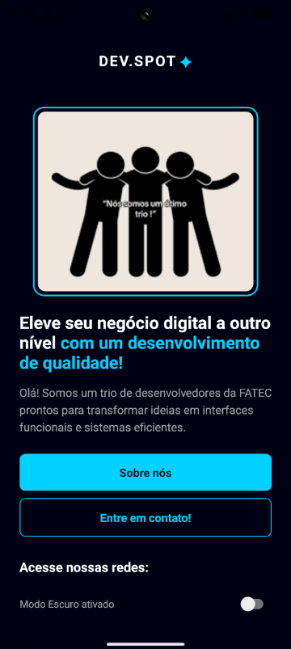
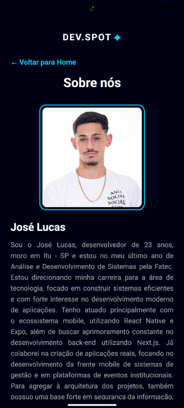
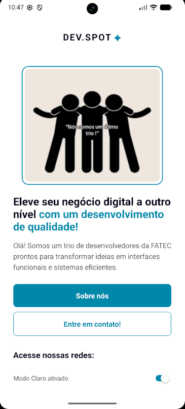
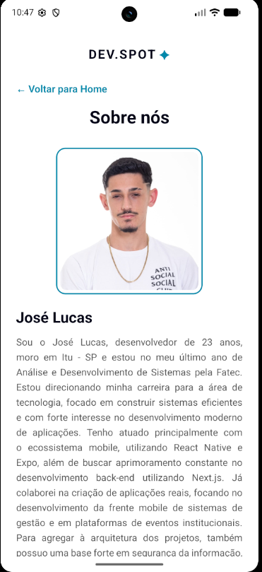

# 📱 DEV.SPOT - Atividade Bimestral


## 👥 Integrantes do Grupo
Trabalho desenvolvido em trio por alunos do curso de Análise e Desenvolvimento de Sistemas (ADS) da FATEC:
- **José Lucas**
- **Guilherme Francisco**
- **Leonardo Araujo**

## 📖 Descrição do App
O DEV.SPOT é um aplicativo mobile construído como requisito de avaliação bimestral. O projeto foca na aplicação de conceitos fundamentais de desenvolvimento mobile, com ênfase em arquitetura limpa, navegação entre telas e design responsivo.

O aplicativo conta com duas telas principais:
1. **Home:** Interface de apresentação com botões de ação, controle de tema e integração com redes sociais.
2. **Sobre nós:** Biografia detalhada dos desenvolvedores com suporte a rolagem e imagens personalizadas.

### ✨ Diferenciais Técnicos (Requisitos Atendidos)
- **Componentização Avançada:** Criação de componentes reutilizáveis (como o `SocialButton` e `Integrante`) localizados na pasta `/src/components`.
- **Tipagem com TypeScript:** Uso de `Interfaces` para garantir a integridade dos dados passados via `props`, evitando o uso de `any`.
- **Dark/Light Mode Dinâmico:** Implementação de troca de tema em tempo real que persiste entre as telas através de parâmetros de navegação.
- **Deep Linking:** Integração com a API `Linking` para abertura de perfis externos.
- **Estilização Modular:** Separação completa da lógica de estilos em arquivos `styles.ts` dedicados.

## 📸 Prints das Telas

<div align="center">
  
  
  
  
</div>

## 🚀 Como rodar o projeto

Siga os passos abaixo para executar o aplicativo.

**Pré-requisitos:**
- Node.js e NPM instalados.
- Expo Go instalado no smartphone ou emulador configurado.

**Passo a passo:**

**1. Clone este repositório:**
```bash
    git clone [https://github.com/JoseMGomes/devspot-app.git](https://github.com/JoseMGomes/devspot-app.git)


2. Acesse a pasta do projeto:
    cd devspot-app


3. Instale as dependências:
    npm install


4. Inicie o servidor do Expo:
    npx expo start


5. Para visualizar o app:
    Escaneie o QR Code via terminal ou navegador utilizando o app Expo Go.

Desenvolvido por Trio FATEC - Projeto acadêmico.